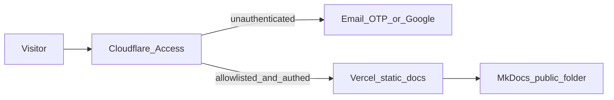

# Access control (Cloudflare Access)

Project LARP documentation is **invitation-only**. Access is enforced by
**Cloudflare Zero Trust Access** in front of the Vercel static site — not by a
login page inside MkDocs.

Unauthenticated visitors hit Cloudflare first (email one-time PIN and/or Google).
Only allowlisted identities reach the MkDocs HTML on Vercel.



Partner-facing policy: [Security and privacy](security-privacy.md).  
Deploy settings: [Deploy to Vercel](deploy-vercel.md).

!!! warning "Custom domain required"
    Cloudflare Access needs a hostname you control on Cloudflare. You generally
    **cannot** put Access in front of `*.vercel.app` alone. Use a custom domain
    (example: `docs.projectlarp.com`) as the **canonical** docs URL. Treat
    `https://projectlarp.vercel.app` as a bypass risk until it is blocked or
    redirected (see [Ops checklist](#ops-checklist-required)).

---

## Ops checklist (required)

Complete these before sharing the docs URL with external parties:

| Step | Action | Why |
|------|--------|-----|
| 1 | Own a domain; add it to Cloudflare; nameservers active | Access attaches to your zone |
| 2 | Point `docs` (or apex) at Vercel with **proxied** (orange-cloud) DNS | Traffic must pass through Cloudflare |
| 3 | Add the same hostname under Vercel → Project → Domains | TLS and correct project routing |
| 4 | Create a Zero Trust Access application + allow policy | Real authentication gate |
| 5 | Enable **One-time PIN** and optionally **Google** | Invite-by-email UX |
| 6 | **Block or redirect** `projectlarp.vercel.app` | Prevent Access bypass |
| 7 | Set GitHub repo **private** (or remove sensitive docs from public git) | Docs auth does not hide a public repo |
| 8 | Update `site_url` in `mkdocs.yml` to the protected hostname; rebuild `public/` | Canonical links / sitemap match reality |
| 9 | Confirm `robots.txt` disallows crawlers | Defense in depth if a URL leaks |

---

## 1. Cloudflare zone and DNS

1. Create or use a [Cloudflare](https://dash.cloudflare.com/) account.
2. **Add site** → enter your domain → complete nameserver delegation.
3. **DNS → Records** → add the docs hostname:

| Type | Name | Target | Proxy |
|------|------|--------|-------|
| CNAME | `docs` | `cname.vercel-dns.com` (or the target Vercel shows for your project) | **Proxied** (orange cloud) |
| CNAME | `www` | `cname.vercel-dns.com` | **Proxied** |
| CNAME | `@` | `cname.vercel-dns.com` | **Proxied** (Cloudflare flattens apex CNAME) |

Then in Vercel → **Domains**, add `docs.projectlarp.com`, `www.projectlarp.com`, and `projectlarp.com`.

Host routing: `www` / apex serve the public landing page. `docs` stays behind Access. Do not point Access at the apex or the public site will demand login.

For an apex domain (`projectlarp.com`), Cloudflare CNAME flattening is preferred over raw A records. Keep the proxy **on**.

!!! tip
    If the orange cloud is off (DNS only), Access will not protect the origin.

---

## 2. Vercel custom domain

1. Vercel → project **projectlarp** (root directory `anti-drone-dome`).
2. **Settings → Domains** → add `docs.yourdomain.com` (same hostname as DNS).
3. Leave build settings as in [Deploy to Vercel](deploy-vercel.md) (prebuilt `public/`).
4. Wait until the domain shows **Valid** / ready.

---

## 3. Cloudflare Zero Trust Access application

1. Open [Cloudflare Zero Trust](https://one.dash.cloudflare.com/) → **Access** → **Applications**.
2. **Add an application** → **Self-hosted**.
3. Configure:

| Field | Suggested value |
|-------|-----------------|
| Application name | `Project LARP Docs` |
| Session duration | `24 hours` (shorter for highly sensitive shares) |
| Application domain | `docs.yourdomain.com` (path `/` or leave default) |

4. **Identity providers** (Authentication):

   - Enable **One-time PIN** (email OTP) — primary invite path.
   - Optionally enable **Google** for partners who prefer Google login.

5. **Policies** → create an **Allow** policy, for example:

   - **Policy name:** `Allowlisted readers`
   - **Action:** Allow
   - **Include** rules (pick what you need):
     - **Emails** — specific addresses (contractors, advisors)
     - **Emails ending in** — e.g. `@partner.com` for a whole org (use carefully)

6. Do **not** add a broad “allow everyone” or public bypass policy.
7. Save. Unauthenticated visits to `https://docs.yourdomain.com` should show the
   Cloudflare Access login, not MkDocs.

---

## 4. Invite and revoke

### Invite

1. Zero Trust → Access → Applications → **Project LARP Docs** → edit policy.
2. Add the person’s email under **Include → Emails**.
3. Send them only the **protected** URL (`https://docs.yourdomain.com`), plus any NDA.
4. They open the link → enter email → receive OTP (or use Google) → access docs.

### Revoke

1. Remove their email (or domain rule) from the Access policy.
2. Optionally **Revoke** existing sessions under Zero Trust → Access → **Access** logs / user sessions if available for your plan.
3. Notify them that access has ended.

Internal disputes or offboarding: revoke Access **and** confirm they no longer
have git access if the repo is shared.

---

## 5. Block `projectlarp.vercel.app` bypass

Access on the custom domain does **not** automatically lock the Vercel default
hostname. Choose one:

1. **Preferred:** Vercel → project → **Deployment Protection** / password or
   standard protection so `*.vercel.app` is not anonymously public, **or**
2. Remove unused preview/production aliases you do not need, **or**
3. Redirect `projectlarp.vercel.app` to the Cloudflare hostname (still prefer
   protection on the Vercel hostname so raw HTML cannot be fetched without auth).

After cutover, share **only** the Cloudflare-protected URL with external readers.

---

## 6. GitHub: close the source back door

Site auth does not protect git history.

1. GitHub → [herman888/defenderproject](https://github.com/herman888/defenderproject) →
   **Settings → General → Danger Zone → Change repository visibility → Private**.
2. Audit who has collaborator / org access; remove people who should not see IP.
3. If the repo must stay public for other reasons, **do not** publish sensitive
   docs, evidence packs, or firmware configs in the public tree — keep them in a
   private docs repo or private release.

---

## 7. MkDocs / `site_url` after cutover

When the protected hostname is live:

1. Set `site_url` in `mkdocs.yml` to `https://docs.yourdomain.com` (your real host).
2. Rebuild:

```bash
cd anti-drone-dome
source .venv-docs/bin/activate
mkdocs build -d public
```

3. Commit and push so Vercel serves the updated sitemap/canonical URLs.

`documentation/robots.txt` is committed to discourage indexing if a URL ever
leaks; **Access remains the real control plane**.

---

## 8. Verification

| Check | Expected |
|-------|----------|
| Incognito → `https://docs.yourdomain.com` | Cloudflare Access challenge |
| Non-allowlisted email | Denied / no OTP success into the app |
| Allowlisted email + OTP or Google | Full MkDocs site |
| Incognito → `https://projectlarp.vercel.app` | Not a public docs dump (blocked/redirected) |
| Anonymous git clone of sensitive material | Repo private or sensitive paths absent |

---

## What not to do

- Do **not** rely on a client-side password page in static HTML/JS (bypassable).
- Do **not** put shared passwords in the MkDocs source or git.
- Do **not** treat synthetic campaign results as field certification (see site copyright and [Security and privacy](security-privacy.md)).
