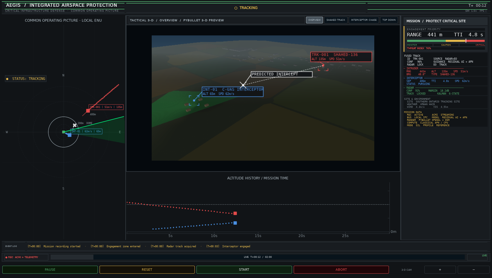
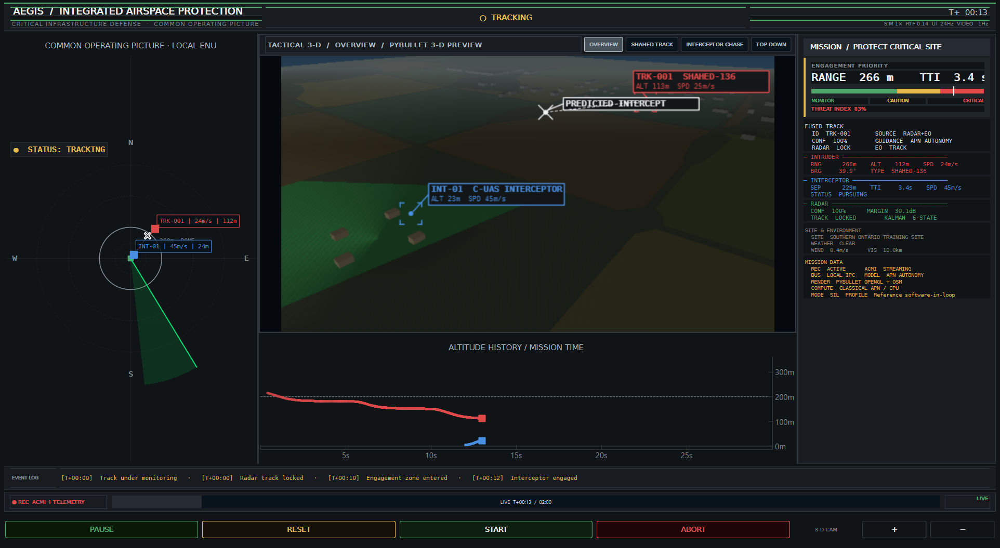
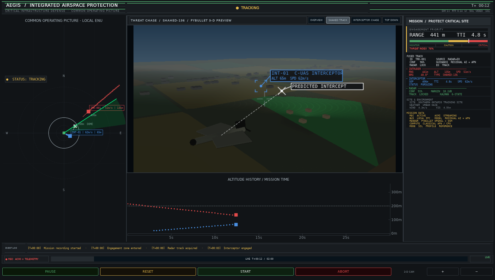
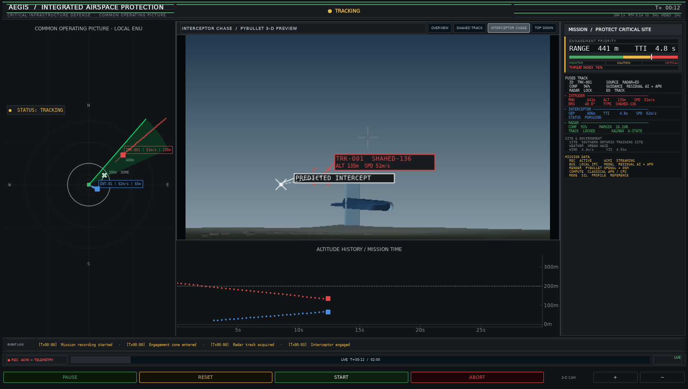

# Evidence gallery

These captures are generated from the current simulator and are retained as
visual evidence, not concept art.

---

## How to add an image

1. Put the file in `documentation/assets/` (e.g. `sim-dashboard.png`)
2. Reference it in Markdown:

```markdown

```

3. Save — `mkdocs serve` live-reloads

---

### Integrated command center



### Live engagement at T+13



### Aircraft chase views





## Future evidence categories

Hardware photographs, held-out detection overlays, and field-demonstration
stills are intentionally absent until they are accompanied by provenance,
permissions, and the relevant validation record. They must not be replaced with
concept art or unlabeled images.

---

!!! tip
    Keep web images compressed and preserve the original evidence under
    `reports/`.
