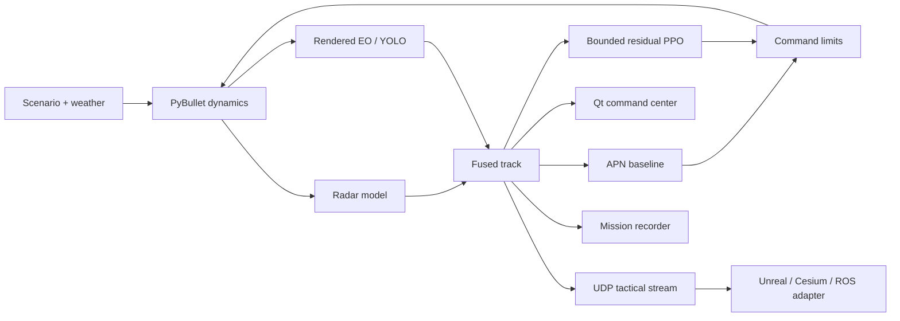

# System architecture

AEGIS is a modular counter-UAS research and validation stack. PyBullet is the
authoritative dynamics process; the command center, sensors, controllers,
recording, and optional external renderer consume the same mission state.

## Authority and boundaries

| Layer | Authority | Notes |
|---|---|---|
| Dynamics | PyBullet | Local ENU state, collision, forces, terrain |
| Nominal guidance | APN | Default and safety baseline |
| Learned guidance | Residual PPO | Bounded correction; does not replace limits |
| Track state | Radar/EO fusion | Shared by UI, guidance, recording, and stream |
| Presentation | Qt/PyBullet preview | Operational preview, not photorealistic truth |
| External rendering | `aegis.tactical.v1` UDP | Engine-independent presentation boundary |
| Evidence | Mission and validation schemas | Seeds, runtime identity, outcomes, hashes |

## Operational use case

The implemented workflow models critical-infrastructure airspace protection:

1. Detect an inbound aircraft.
2. Correlate radar and EO observations into a fused track.
3. Maintain a common operating picture.
4. Generate and supervise an intercept solution.
5. Record telemetry, events, and ACMI replay.
6. Evaluate the same controller against deterministic stress cases.

## What is not claimed

- The embedded renderer is not photorealistic or a certified digital twin.
- Synthetic interception rates are not real-world reliability claims.
- Betaflight/MSP profiles are read-only; they are not an implemented command
  bridge.
- Real actuation requires independent safety review, approved range procedures,
  protocol validation, and measured hardware evidence.

